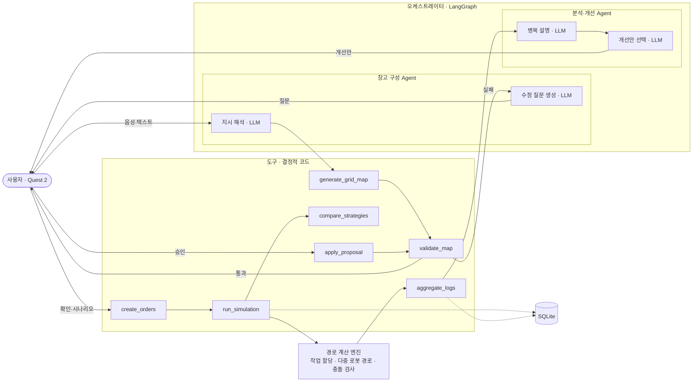
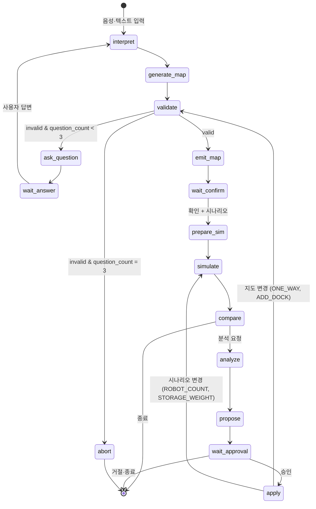
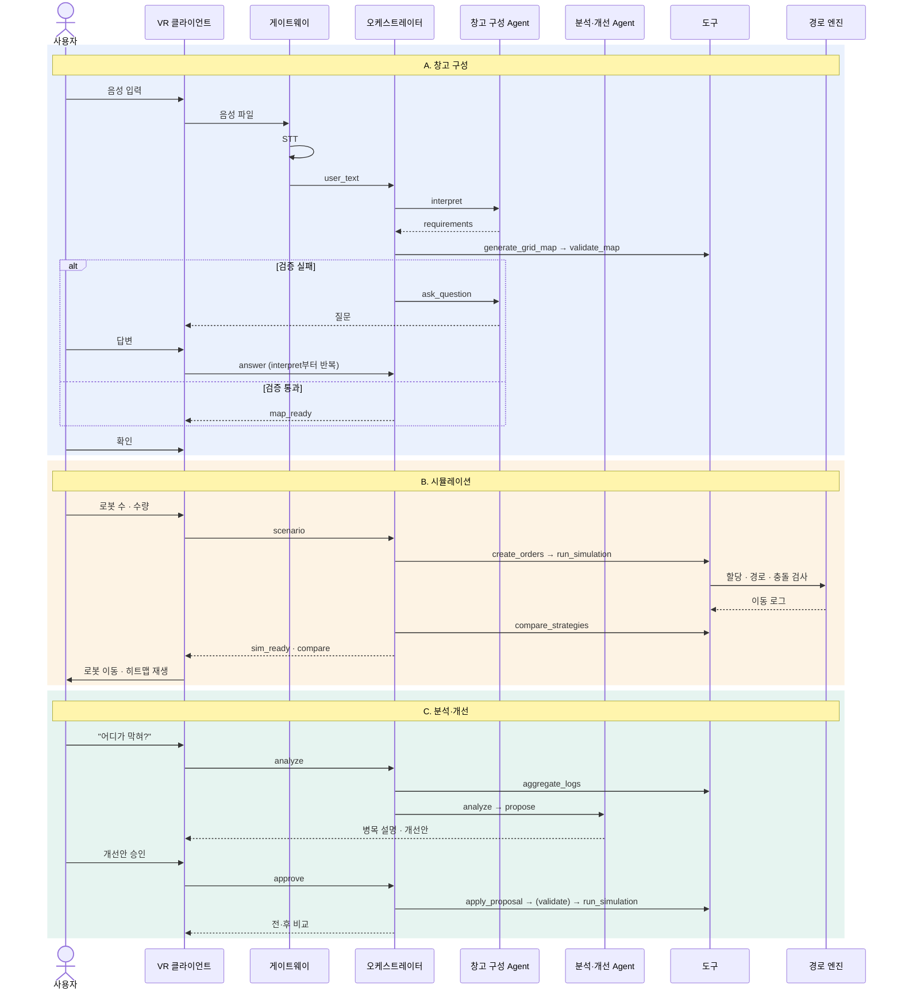

# 에이전트 구성 및 전체 흐름

| 항목 | 내용 |
|---|---|
| 과제명 | 말로 짓고 로봇이 달리는 무인 물류창고 |
| 팀 | 로봇웨어하우스 (방유진 · 백향 · 하재윤) |
| 근거 문서 | 참가 신청서, 시스템 아키텍처, 요구사항 명세서, 구현 시나리오 |
| 문서 버전 | v0.1 (2026-10-01 초안) |

**요약**

이 시스템은 **LangGraph 오케스트레이터 1개** 안에 **LLM 에이전트 2개**(창고 구성 Agent, 분석·개선 Agent)와 **결정적 도구 7개**를 두고, 경로 계산은 LLM이 아닌 **경로 계산 엔진**이 맡는 구조입니다. LLM은 "말을 구조로 바꾸기", "문제를 사용자에게 묻기", "결과를 설명하고 개선안 고르기" 세 곳에서만 쓰입니다. 사용자는 세 번의 승인 지점(지도 확인, 수정 답변, 개선안 승인)에서 흐름에 개입합니다.

> 노드·도구 이름과 코드는 설계 예시입니다. 구현하면서 바뀌면 이 문서와 `docs/api.md`를 함께 고칩니다.

---

## 1. 한눈에 보는 구성



---

## 2. 구성 원칙

| 원칙 | 내용 | 이유 |
|---|---|---|
| 계산과 판단의 분리 | 격자 좌표 생성, 검증, 경로 계산, 집계는 결정적 코드가 맡고, LLM은 해석·질문·설명·선택만 맡는다 | 같은 입력에 같은 결과, 충돌 0건 보장, 수치를 지어내지 않음 |
| 승인 후 반영 | LLM이 만든 지도와 개선안은 검증 도구와 사용자 승인을 거친 뒤에만 반영 | LLM 오류가 시뮬레이션 결과로 번지지 않게 함 |
| 단일 데이터 계약 | 모든 노드·도구가 격자 지도 스키마(DR-01)와 로그 형식(DR-03)을 공유 | VR·엔진·Agent의 병렬 개발 |
| 근거 제한 | 분석 LLM에는 원본 로그가 아니라 집계 결과만 전달 | 토큰 절약, 근거 없는 수치 차단 |
| 행동 공간 제한 | 개선안은 엔진이 적용할 수 있는 4개 유형 안에서만 고름 | 실행 불가능한 제안 방지 |

---

## 3. 에이전트·도구 구성

### 3.1 구성 요소

| 구성 요소 | 종류 | 역할 | LLM 사용 | 담당 |
|---|---|---|:-:|---|
| 오케스트레이터 | LangGraph 상태 그래프 | 상태를 보고 다음 노드를 정하는 규칙 기반 라우터, 사용자 대기 지점 관리 | X | 방유진 |
| 창고 구성 Agent | LLM 노드 2개 | 자연어 → 요구사항 JSON 추출, 검증 오류 → 사용자 질문 생성 | O | 방유진 |
| 분석·개선 Agent | LLM 노드 2개 | 집계 결과 → 병목 원인 설명, 개선안 후보 중 선택·설명 | O | 방유진 |
| 도구 7개 | Python 함수 | 지도 생성·검증, 주문 생성, 시뮬레이션, 집계, 비교, 개선안 적용 | X | 방유진·하재윤 |
| 경로 계산 엔진 | Python 모듈 | 보관 위치 선정, 작업 할당, 다중 로봇 경로 계획, 충돌 검사, 재계획, 기준 전략 | X | 하재윤 |
| STT · TTS | 외부 API | 음성 ↔ 텍스트 (게이트웨이에서 호출, 그래프 밖) | — | 방유진 |
| 사용자 | 사람 | 입력, 지도 확인, 질문 답변, 개선안 승인 | — | — |

> 오케스트레이터는 LLM으로 다음 단계를 고르지 않습니다. 단계 전환이 상태 값으로 정해지므로 시연 중 흐름이 엇나가지 않습니다. LLM이 판단하는 부분은 각 Agent 안의 "무엇을 묻고, 무엇을 제안할지"입니다.

### 3.2 도구 명세

| 도구 | 입력 | 출력 | 오류 | 호출 노드 |
|---|---|---|---|---|
| `generate_grid_map` | `requirements` (랙 줄 수, 통로 폭, 도크, 충전, 구역, 일방통행) | 격자 지도 JSON, `defaults_applied[]` | 요구사항 범위 초과 | generate_map |
| `validate_map` | 격자 지도 | `{valid, errors: [{code, cells, message}]}` | — (오류는 결과로 반환) | validate |
| `create_orders` | 시나리오 (로봇 수, 입하·출하 수량, 규격, 시드) | `orders[]` | 수량 0 또는 음수 | prepare_sim |
| `run_simulation` | 지도, 주문, 로봇 수, 전략, 시드, (이벤트) | `sim_id`, 로그 요약, `collisions` | 충돌 1건 이상 → 결과 미전송 | simulate |
| `aggregate_logs` | `sim_id` | 총 처리 스텝, 주문당 평균, 칸별 통과·대기, 대기 상위 10칸, 구역별 대기 합, 로봇별 유휴 | — | analyze |
| `compare_strategies` | `sim_id` 2개 | 두 전략 지표, 개선율 | 지도·시나리오 불일치 | compare |
| `apply_proposal` | 개선안 `{type, params}`, 지도·시나리오 | 새 지도(`map_version`) 또는 새 시나리오 | 허용 유형 밖 | apply |

**검증 오류 코드** (`validate_map`): `SCHEMA_INVALID`, `UNREACHABLE`, `NO_DOCK_IN`, `NO_DOCK_OUT`, `SIZE_EXCEEDED`

**개선안 유형** (`apply_proposal`): `ONE_WAY`(일방통행 지정) · `STORAGE_WEIGHT`(보관 위치 가중치) · `ROBOT_COUNT`(로봇 수) · `ADD_DOCK`(도크 추가)

---

## 4. 상태(State) 정의

```python
from typing import TypedDict, Literal, Optional

Phase = Literal[
    "INPUT", "WAIT_ANSWER", "WAIT_CONFIRM", "WAIT_SCENARIO",
    "SIMULATED", "WAIT_APPROVAL", "DONE", "ABORT",
]

class AgentState(TypedDict, total=False):
    session_id: str
    phase: Phase

    # 창고 구성
    user_text: str                  # 원 입력 (STT 결과 포함)
    answers: list[str]              # 수정 질문에 대한 답변 누적
    requirements: dict              # LLM 추출 결과
    map: dict                       # 격자 지도 (DR-01)
    map_version: str
    defaults_applied: list[str]
    validation: dict                # {valid, errors}
    question: Optional[str]
    question_count: int             # 상한 3
    llm_retry: int                  # 형식 오류 재시도, 상한 2

    # 시뮬레이션
    scenario: dict                  # DR-02
    sim_ids: dict                   # {"optimized": id, "baseline": id}
    summary: dict

    # 분석·개선
    stats: dict                     # aggregate_logs 결과
    explanation: str
    proposals: list[dict]           # [{id, type, params, reason}]
    approved_proposal: Optional[str]
    history: list[dict]             # 개선 전·후 비교 기록
```

---

## 5. 그래프 구조

### 5.1 노드

| 노드 | 소속 | 하는 일 | LLM | 다음 노드 |
|---|---|---|:-:|---|
| `interpret` | 창고 구성 Agent | `user_text` + `answers` → `requirements` | O | generate_map |
| `generate_map` | 도구 | `generate_grid_map` 호출, DB 저장 | X | validate |
| `validate` | 도구 | `validate_map` 호출 | X | 통과 → `emit_map` / 실패 → `ask_question` |
| `ask_question` | 창고 구성 Agent | 오류 코드·좌표 → 사용자 질문 문장 | O | `wait_answer` |
| `wait_answer` | 대기 지점 | 사용자 답변까지 정지 (`phase=WAIT_ANSWER`) | X | interpret |
| `emit_map` | 출력 | `map_ready` 전송 | X | `wait_confirm` |
| `wait_confirm` | 대기 지점 | 지도 확인 + 시나리오 입력까지 정지 | X | prepare_sim |
| `prepare_sim` | 도구 | `create_orders` 호출 | X | simulate |
| `simulate` | 도구 | `run_simulation`(optimized, 필요 시 baseline) | X | compare |
| `compare` | 도구 | `compare_strategies` 호출, `sim_ready`·`compare` 전송 | X | 종료 대기 (분석 요청 시 analyze) |
| `analyze` | 분석·개선 Agent | `aggregate_logs` → LLM 병목 설명 | O | propose |
| `propose` | 분석·개선 Agent | 규칙으로 만든 개선안 후보 중 LLM이 1~3개 선택·설명 | O | `wait_approval` |
| `wait_approval` | 대기 지점 | 사용자 승인까지 정지 | X | apply |
| `apply` | 도구 | `apply_proposal` → 지도가 바뀌면 validate, 아니면 simulate | X | validate 또는 simulate |

### 5.2 상태 전이



### 5.3 라우팅 규칙

| 분기 위치 | 조건 | 이동 |
|---|---|---|
| validate 이후 | `validation.valid == True` | emit_map |
| | `valid == False` and `question_count < 3` | ask_question |
| | `valid == False` and `question_count >= 3` | abort ("입력을 다시 해 주세요") |
| | 오류가 `SCHEMA_INVALID`뿐 | 사용자에게 묻지 않고 interpret 재실행 (`llm_retry` 증가) |
| interpret 이후 | LLM 출력이 스키마 불일치, `llm_retry < 2` | interpret 재실행 |
| | `llm_retry >= 2` | ask_question ("다시 설명해 주세요") |
| apply 이후 | 개선안이 지도를 바꿈 | validate (새 `map_version`) |
| | 시나리오만 바꿈 | simulate |
| 재생 중 이벤트 | 주문 추가·로봇 수 변경 | simulate (롤링 재계획, 이벤트 시점 이전 결과 유지) |

### 5.4 사용자 개입 지점 (Human-in-the-loop)

| 지점 | VR에 보이는 것 | 사용자 행동 | 그래프 재개 방식 |
|---|---|---|---|
| `wait_answer` | 질문 + 문제 칸 강조 | 답변 (음성·텍스트) | `POST /map/answer` → `answers`에 추가 후 재개 |
| `wait_confirm` | 3D 창고 + 요약 + 기본값 안내 | 확인, 시나리오 입력 | `POST /map/confirm`, `POST /scenario` → 재개 |
| `wait_approval` | 병목 마커 + 설명 + 개선안 버튼 | 개선안 하나 승인 또는 종료 | `POST /improve/approve` → 재개 |

---

## 6. LLM 호출 설계

> 모든 LLM 호출은 출력 JSON 스키마를 정해 두고(function calling 또는 구조화 출력), 받은 뒤 코드로 다시 검증합니다. temperature는 0으로 둡니다.

### 6.1 지시 해석 (`interpret`)

| 항목 | 내용 |
|---|---|
| 역할 지시 요지 | "창고 설명에서 수치와 배치만 추출한다. 좌표는 만들지 않는다. 말하지 않은 값은 null로 둔다." |
| 입력 | `user_text`, 이전 `answers`, 직전 `requirements`(있으면) |
| 출력 스키마 | `{racks, aisle_width_m, rack_levels, dock_in: {count, side}, dock_out: {count, side}, charge_side, zones, one_way: [{aisle, dir}]}` |
| 후처리 | 숫자 범위 검사(예: 랙 1~20줄), null 항목은 `generate_grid_map`이 기본값으로 채움 |
| 예시 | "랙 8줄, 통로 폭 3미터, 입하 도크 2개, 출하 도크 1개" → `{racks: 8, aisle_width_m: 3, dock_in: {count: 2}, dock_out: {count: 1}, ...}` |

### 6.2 수정 질문 생성 (`ask_question`)

| 항목 | 내용 |
|---|---|
| 역할 지시 요지 | "검증 오류를 사용자가 바로 답할 수 있는 질문 하나로 바꾼다. 원인을 한 문장으로 말하고, 답의 형태를 예시로 준다." |
| 입력 | `validation.errors` (코드, 좌표), `requirements` |
| 출력 스키마 | `{question, target_fields[]}` |
| 예시 | `NO_DOCK_IN` → "입하 도크가 없어 물건이 들어올 곳이 없습니다. 입하 도크는 몇 개, 어느 벽에 둘까요? (예: 1개, 왼쪽 벽)" |

### 6.3 병목 설명 (`analyze`)

| 항목 | 내용 |
|---|---|
| 역할 지시 요지 | "주어진 집계 수치만 근거로 병목 위치와 원인을 설명한다. 주어지지 않은 수치는 쓰지 않는다." |
| 입력 | `aggregate_logs` 결과 (대기 상위 10칸, 구역별 대기 합, 로봇별 유휴, 전략 비교 지표) |
| 출력 스키마 | `{bottlenecks: [{x, y, wait, cause}], explanation}` |
| 후처리 | `explanation` 속 숫자가 입력 집계에 있는지 코드로 확인, 없으면 재생성 |

### 6.4 개선안 선택 (`propose`)

| 항목 | 내용 |
|---|---|
| 방식 | 규칙 코드가 4개 유형으로 후보를 먼저 만들고(예: 대기 상위 통로 → `ONE_WAY` 후보), LLM은 그중 1~3개를 골라 이유를 쓴다 |
| 역할 지시 요지 | "후보 목록에 있는 개선안만 고른다. 고른 이유를 병목 위치·수치와 연결해 설명한다." |
| 입력 | 병목 결과, 개선안 후보 목록 `[{id, type, params}]` |
| 출력 스키마 | `{proposals: [{id, reason}]}` |
| 후처리 | 반환한 `id`가 후보 목록에 있는지 확인 |

---

## 7. 전체 흐름

### 7.1 단계별 흐름

**A. 창고 구성 (FR-01~10)**

1. 사용자가 Quest 2에서 창고를 말하거나 입력한다.
2. 게이트웨이가 STT로 텍스트를 만들고 `transcript`를 VR에 보낸다.
3. 창고 구성 Agent(`interpret`)가 요구사항 JSON을 추출한다.
4. `generate_grid_map`이 격자 지도를 만들고 DB에 버전을 붙여 저장한다.
5. `validate_map`이 형식과 도달 가능성을 검사한다.
6. 실패하면 창고 구성 Agent(`ask_question`)가 질문을 만들고, 사용자 답변을 받아 3번으로 돌아간다 (최대 3회).
7. 통과하면 `map_ready`를 보내고 VR이 3D 창고를 만든다. 사용자가 확인한다.

**B. 시뮬레이션 (FR-11~24)**

8. 사용자가 로봇 수와 입출하 수량을 입력한다.
9. `create_orders`가 주문을 만든다.
10. `run_simulation`이 경로 계산 엔진을 호출한다: 보관 위치 선정 → 작업 할당 → 다중 로봇 경로 → 충돌 검사.
11. 같은 조건으로 기준 전략도 실행하고 `compare_strategies`로 비교한다.
12. `sim_ready`를 보내고 VR이 프레임을 받아 로봇 이동, 경로 선, 히트맵을 재생한다.

**C. 분석·개선 (FR-25~29)**

13. 사용자가 "분석"을 누르거나 "어디가 막혀?"라고 묻는다.
14. `aggregate_logs`가 칸별 통과·대기와 병목 후보를 집계한다.
15. 분석·개선 Agent(`analyze`)가 수치를 근거로 병목 원인을 설명한다.
16. 규칙 코드가 개선안 후보를 만들고, 분석·개선 Agent(`propose`)가 1~3개를 골라 이유를 붙인다.
17. 사용자가 개선안을 승인하면 `apply_proposal`이 지도나 시나리오를 바꾼다. 지도가 바뀌면 5번(검증)부터, 시나리오만 바뀌면 10번부터 다시 실행한다.
18. 적용 전·후 결과를 비교해 VR에 보여 준다.

**D. 재계획 (FR-19)**

19. 재생 중 주문이 추가되거나 로봇 수가 바뀌면, 이벤트 시점 이전 결과는 유지하고 이후 구간만 10번부터 다시 계산한다.

### 7.2 전체 시퀀스



---

## 8. 메모리와 피드백

| 종류 | 저장 위치 | 내용 | 쓰임 |
|---|---|---|---|
| 대화 상태 | LangGraph 체크포인터 (세션별) | `AgentState` 전체 | 질문·답변 이어 가기, 대기 지점에서 재개, 서버 재연결 시 복구 |
| 지도 버전 | SQLite `maps` | `map_version`, 지도 JSON, 검증 결과, 생성 근거(요구사항) | 수정 전·후 비교, 재현 |
| 시뮬레이션 로그 | SQLite `sims`, `frames`, `cell_stats`, `orders` | DR-03 | VR 재생, 집계, 비교 |
| 사용자 피드백 | SQLite `approvals` | 승인·거절한 개선안, 결과 지표 | 같은 세션에서 이미 거절한 개선안을 다시 제안하지 않음 |
| 실행 추적 | 서버 로그 | 노드 순서, 도구 입출력 요약, LLM 응답 시간 | 디버깅, 시연 화면, 보고서 근거 |

---

## 9. 오류·예외 처리

| 상황 | 처리 | 사용자에게 보이는 것 |
|---|---|---|
| LLM 출력 스키마 불일치 | 같은 노드 재실행 최대 2회 → 실패 시 질문으로 전환 | "다시 이해해 볼게요" |
| 수정 질문 3회 초과 | abort, 상태 초기화 | "입력을 다시 해 주세요" |
| LLM 설명에 근거 없는 수치 | 1회 재생성 → 실패 시 집계 표만 표시 | 수치 표 |
| LLM이 후보 밖 개선안 반환 | 해당 항목 버림, 남은 것만 표시 | 개선안 개수 감소 |
| 충돌 1건 이상 | 결과 미전송, 로그 기록 | "계산 오류, 로봇 수를 줄여 다시 시도" |
| 외부 API 시간 초과 | 요청 취소 | 재시도 버튼 |
| 서버 재시작 | 체크포인터·DB에서 마지막 상태 복구 | "재연결 중" → 이어서 진행 |

---

## 10. 구현 골격 (LangGraph)

> 흐름을 보여 주기 위한 골격입니다. 실제 LangGraph 버전의 API(대기 지점 처리 방식 등)에 맞춰 고칩니다.

```python
from langgraph.graph import StateGraph, END
from langgraph.checkpoint.memory import MemorySaver

g = StateGraph(AgentState)

g.add_node("interpret", interpret)          # 창고 구성 Agent · LLM
g.add_node("generate_map", generate_map)    # 도구
g.add_node("validate", validate)            # 도구
g.add_node("ask_question", ask_question)    # 창고 구성 Agent · LLM
g.add_node("wait_answer", lambda s: {"phase": "WAIT_ANSWER"})
g.add_node("emit_map", emit_map)
g.add_node("wait_confirm", lambda s: {"phase": "WAIT_CONFIRM"})
g.add_node("prepare_sim", prepare_sim)      # 도구
g.add_node("simulate", simulate)            # 도구 → 경로 엔진
g.add_node("compare", compare)              # 도구
g.add_node("analyze", analyze)              # 분석·개선 Agent · LLM
g.add_node("propose", propose)              # 분석·개선 Agent · LLM
g.add_node("wait_approval", lambda s: {"phase": "WAIT_APPROVAL"})
g.add_node("apply", apply)                  # 도구

g.set_entry_point("interpret")
g.add_conditional_edges("interpret", route_after_interpret,
                        {"retry": "interpret", "ok": "generate_map", "ask": "ask_question"})
g.add_edge("generate_map", "validate")
g.add_conditional_edges("validate", route_after_validate,
                        {"ok": "emit_map", "ask": "ask_question",
                         "retry": "interpret", "abort": END})
g.add_edge("ask_question", "wait_answer")
g.add_edge("wait_answer", "interpret")
g.add_edge("emit_map", "wait_confirm")
g.add_edge("wait_confirm", "prepare_sim")
g.add_edge("prepare_sim", "simulate")
g.add_edge("simulate", "compare")
g.add_conditional_edges("compare", lambda s: "analyze" if s.get("analyze_requested") else "end",
                        {"analyze": "analyze", "end": END})
g.add_edge("analyze", "propose")
g.add_edge("propose", "wait_approval")
g.add_conditional_edges("wait_approval",
                        lambda s: "apply" if s.get("approved_proposal") else "end",
                        {"apply": "apply", "end": END})
g.add_conditional_edges("apply", route_after_apply,
                        {"map_changed": "validate", "scenario_changed": "simulate"})

graph = g.compile(
    checkpointer=MemorySaver(),
    interrupt_after=["wait_answer", "wait_confirm", "wait_approval"],  # 사용자 입력까지 정지
)


def route_after_validate(s: AgentState) -> str:
    v = s["validation"]
    if v["valid"]:
        return "ok"
    codes = {e["code"] for e in v["errors"]}
    if codes == {"SCHEMA_INVALID"} and s.get("llm_retry", 0) < 2:
        return "retry"
    if s.get("question_count", 0) >= 3:
        return "abort"
    return "ask"
```

게이트웨이는 사용자 입력이 오면 같은 `thread_id`(= `session_id`)로 상태를 갱신하고 그래프를 재개합니다.

```python
cfg = {"configurable": {"thread_id": session_id}}
graph.update_state(cfg, {"answers": state["answers"] + [answer_text]})
graph.invoke(None, cfg)   # wait_answer 다음 노드(interpret)부터 재개
```

**확인 방법**

```bash
pytest tests/integration/test_agent_graph.py -q   # 통합 테스트 ITC-11~14
python -m agent.debug_trace --text "랙 6줄, 통로 폭 3미터"  # 노드 순서 출력 → validate 실패 → ask_question 확인
```

---

## 11. 기술설명서 연결

> 기술설명서(1페이지)의 항목을 이 문서의 어느 부분에서 가져오는지 정리했습니다.

| 기술설명서 항목 | 이 문서 위치 | 한 줄 요약 |
|---|---|---|
| Goal | 요약 | 말로 창고를 만들고 다중 로봇 동선·병목을 VR에서 확인·개선 |
| Workflow | 7.1 | 입력 → 해석 → 지도 생성·검증(질문) → 확인 → 시뮬레이션 → 비교 → 분석 → 개선안 승인 → 재시뮬레이션 |
| AI | 3.1, 6장 | LLM 4개 호출 지점(해석, 질문, 설명, 개선안 선택), Whisper STT, TTS |
| Tool / API / Data | 3.2 | 도구 7개, 경로 계산 엔진, 격자 지도 스키마, SQLite |
| Memory / Feedback | 8장 | 세션 상태 체크포인터, 지도 버전, 승인 이력 |
| 신규 개발분 | 3.1 담당 열 | 오케스트레이터 그래프, 도구 7개, 경로 엔진 연계, VR 앱 |
