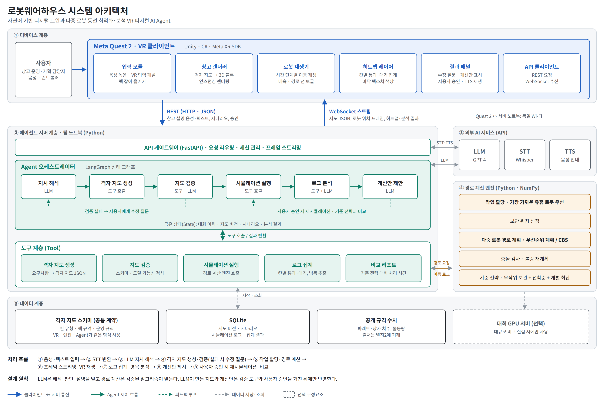
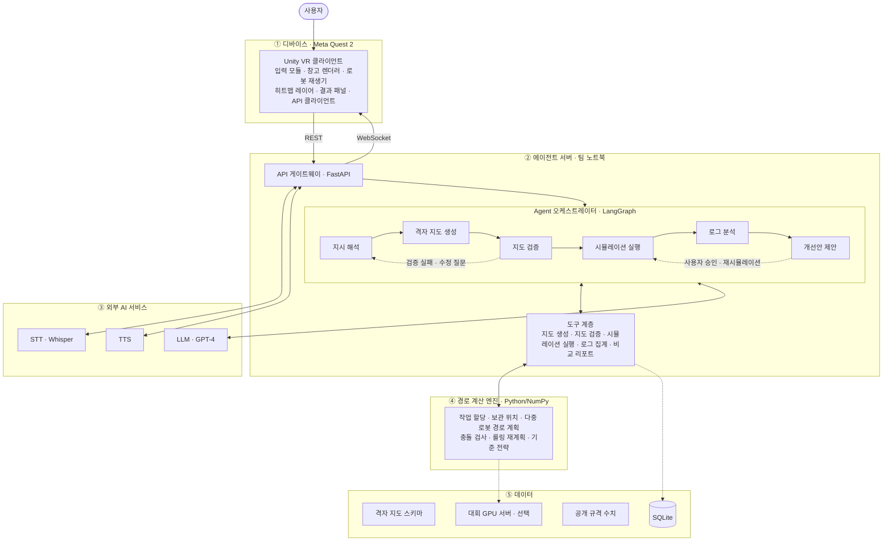

# 로봇웨어하우스 시스템 아키텍처



> 보고서·발표자료에는 PNG를 넣고, 수정이 필요하면 SVG 또는 아래 Mermaid 코드를 고칩니다.

## 1. 계층 구성

| 계층 | 실행 위치 | 구성 요소 | 담당 |
|---|---|---|---|
| ① 디바이스 | Meta Quest 2 | Unity VR 클라이언트: 입력 모듈, 창고 렌더러, 로봇 재생기, 히트맵 레이어, 결과 패널, API 클라이언트 | 백향 |
| ② 에이전트 서버 | 팀 노트북 | FastAPI 게이트웨이, LangGraph 오케스트레이터(6개 노드), 도구 계층(5개) | 방유진 |
| ③ 외부 AI 서비스 | 클라우드 API | LLM(GPT-4), STT(Whisper), TTS | 방유진 |
| ④ 경로 계산 엔진 | 팀 노트북 | 작업 할당, 보관 위치, 다중 로봇 경로 계획, 충돌 검사·롤링 재계획, 기준 전략 | 하재윤 |
| ⑤ 데이터 | 팀 노트북 | 격자 지도 스키마, SQLite, 공개 규격 수치, 대회 GPU 서버(선택) | 전원 |

## 2. Agent 오케스트레이터 노드

| 노드 | 판단 주체 | 입력 → 출력 | 다음 노드 |
|---|---|---|---|
| 지시 해석 | LLM | 음성·텍스트 → 창고 구성 요구사항 | 격자 지도 생성 |
| 격자 지도 생성 | 도구 | 요구사항 → 격자 지도 JSON | 지도 검증 |
| 지도 검증 | 도구 + LLM | 격자 지도 → 통과 / 수정 질문 | 통과: 시뮬레이션 실행 / 실패: 지시 해석(수정 질문) |
| 시뮬레이션 실행 | 도구 → 경로 계산 엔진 | 지도 + 주문 + 로봇 수 → 이동 로그 | 로그 분석 |
| 로그 분석 | 도구 + LLM | 이동 로그 → 혼잡도, 병목 구간 | 개선안 제안 |
| 개선안 제안 | LLM | 분석 결과 → 개선안 | 사용자 승인 시 시뮬레이션 실행(재실행) |

## 3. 인터페이스

> 엔드포인트 이름은 설계 예시입니다. 실제 구현에 맞춰 `docs/api.md`와 함께 고칩니다.

| 구간 | 방식 | 주고받는 데이터 |
|---|---|---|
| Quest 2 → 서버 | REST (HTTP·JSON) | 창고 설명(음성 파일·텍스트), 시나리오(물량·로봇 수), 수정 답변, 개선안 승인 |
| 서버 → Quest 2 | WebSocket | 격자 지도 JSON, 시간 단계별 로봇 위치 프레임, 칸별 통과·대기 집계, 분석·개선안 텍스트, TTS 음성 |
| 오케스트레이터 ↔ 외부 API | HTTPS | 프롬프트·응답(LLM), 음성 → 텍스트(STT), 텍스트 → 음성(TTS) |
| 도구 ↔ 경로 계산 엔진 | Python 함수 호출 | 격자 지도·주문·로봇 상태 → 이동 로그·충돌 검사 결과 |
| 도구 ↔ SQLite | SQL | 지도 버전, 시나리오, 시뮬레이션 로그, 집계 결과 |

**네트워크 전제:** Quest 2와 서버 노트북을 같은 Wi-Fi에 연결하고, VR 앱 설정 패널에서 서버 IP를 입력합니다.

## 4. 설계 원칙

- **계산과 판단의 분리:** LLM은 해석·판단·설명을 맡고, 경로 계산은 검증된 알고리즘이 맡습니다.
- **승인 후 반영:** LLM이 만든 지도와 개선안은 검증 도구와 사용자 승인을 거친 뒤에만 반영합니다.
- **단일 데이터 계약:** 격자 지도 스키마 하나를 VR, 경로 계산 엔진, Agent가 함께 씁니다.
- **VR 경량화:** Quest 2의 프레임을 유지하려고 무거운 계산은 서버가 맡고, VR은 기본 도형과 인스턴싱 렌더링으로 재생만 합니다.

## 5. Mermaid 원본 (편집용)



---

## 6. 스켈레톤 폴더 구조

> 실제 파일로 만든 스켈레톤: `로봇웨어하우스_스켈레톤.zip` (파일 180여 개). 압축을 풀고 `server`에서 `pytest -q`를 실행하면 30 passed, 1 skipped, 3 xfailed가 나옵니다. xfail은 아직 구현하지 않은 기능의 테스트이며, 구현하면 xfail 표시를 지웁니다.

### 6.1 최상위

```
robot-warehouse/
├─ README.md                 # 실행 방법, 팀, 테스트 명령
├─ SOURCES.md                # 별지2 출처·AI 활용 원본
├─ .gitignore                # .env, Unity Library/Temp, APK, DB 제외
├─ docs/
│  ├─ schema.md              # 격자 지도 스키마 (세 파트 공통 계약)
│  ├─ api.md                 # Unity ↔ 서버 API 명세
│  └─ architecture/          # 구조도, 요구사항, 시나리오, 테스트 문서
├─ server/                   # ② 에이전트 서버 + ④ 경로 계산 엔진 + ⑤ 데이터
├─ unity/RobotWarehouse/     # ① VR 클라이언트
├─ experiments/              # 비교 실험 (보고서 4.2 수치)
├─ scripts/                  # 개발 보조 (레이아웃 비교 등)
└─ build/                    # Quest 2 APK (커밋하지 않고 Releases에 첨부)
```

### 6.2 server

```
server/
├─ requirements.txt · .env.example · pytest.ini · config.py
├─ api/                       # 게이트웨이 (FastAPI)                    방유진
│  ├─ main.py                 #   create_app(db_path, llm, stt, tts) — 의존성 주입
│  ├─ deps.py                 #   Repo·LLM·STT·TTS 묶음
│  ├─ ws.py                   #   /ws 세션, hello·메시지 전송 (IR-02)
│  ├─ routes_map.py           #   /map/text·voice·answer·confirm·edit (SC-01~03, 11)
│  ├─ routes_sim.py           #   /scenario, /sim/{id}/frames·stats·event (SC-04~08)
│  └─ routes_analysis.py      #   /analyze, /improve/approve (SC-09, 10)
├─ agent/                     # 오케스트레이터 + LLM 에이전트 2개       방유진
│  ├─ state.py                #   AgentState
│  ├─ graph.py                #   build_graph() — 노드 14개, 대기 지점 3개
│  ├─ routing.py              #   분기 규칙 (질문 3회, 재시도 2회)
│  ├─ nodes/
│  │  ├─ composer.py          #   창고 구성 Agent: interpret, ask_question (+ generate_map, validate, emit_map)
│  │  ├─ simulation.py        #   prepare_sim, simulate, compare
│  │  └─ analyst.py           #   분석·개선 Agent: analyze, propose (+ apply)
│  ├─ prompts/                #   interpret / ask_question / analyze / propose .md
│  └─ debug_trace.py          #   노드 실행 순서 출력
├─ tools/                     # 결정적 도구 7개                          방유진·하재윤
│  ├─ map_generator.py        #   generate_grid_map (FR-04, 05)
│  ├─ map_validator.py        #   validate_map (FR-06, 07)
│  ├─ orders.py               #   create_orders (FR-12)
│  ├─ simulation.py           #   run_simulation (B4)
│  ├─ aggregate.py            #   aggregate_logs (FR-25, 26)
│  ├─ compare.py              #   compare_strategies, improvement_pct (FR-28)
│  └─ proposals.py            #   build_candidates, apply_proposal (FR-29)
├─ engine/                    # 경로 계산 엔진 — simulate() 하나만 공개    하재윤
│  ├─ simulate.py             #   진입점: 보관 위치 → 할당 → 경로 → 충돌 검사
│  ├─ grid.py                 #   통행 가능 칸, 이웃 칸
│  ├─ storage.py              #   보관 위치 선정 (FR-15)
│  ├─ assignment.py           #   작업 할당 (FR-14)
│  ├─ planner/
│  │  ├─ prioritized.py       #   우선순위 계획 · 시공간 A* (먼저 구현)
│  │  ├─ cbs.py               #   CBS (비교용)
│  │  └─ independent.py       #   기준 전략 · 개별 최단 경로
│  ├─ replan.py               #   롤링 재계획 (FR-19)
│  └─ collision.py            #   불변 조건 검사 (구현 완료, NFR-04)
├─ schema/                    # 공통 데이터 형식 (pydantic)               공동
│  ├─ grid_map.py             #   DR-01
│  ├─ scenario.py             #   DR-02
│  ├─ sim_log.py              #   DR-03
│  └─ messages.py             #   WS type 목록, 오류 코드
├─ services/                  # 외부 API 래퍼 (테스트에서 가짜로 교체)    방유진
│  ├─ llm.py · stt.py · tts.py
├─ db/                        # SQLite                                   방유진·하재윤
│  ├─ schema.sql              #   maps, sims, frames, orders, cell_stats, approvals
│  └─ repo.py                 #   저장·조회는 이 모듈로만
├─ data/                      # 실행 중 생성되는 DB (커밋 제외)
└─ tests/
   ├─ conftest.py · fakes.py  #   픽스처 로더, FakeLLM, FakeSTT
   ├─ unit/                   #   UT · TC-MAP, TC-ENG, 스켈레톤 점검
   ├─ integration/            #   IT · ITC-01~35 (ENV-1)
   ├─ llm/                    #   LT · pytest -m llm (하루 1회)
   └─ fixtures/
      ├─ maps/ · scenarios/ · llm/ · audio/
      └─ sentences.csv        #   지도 생성 성공률 측정 문장
```

### 6.3 unity

```
unity/RobotWarehouse/
├─ Assets/
│  ├─ _Project/                         # 팀 코드는 이 아래에만 (SDK·에셋과 분리)    백향
│  │  ├─ Scripts/   (RobotWarehouse.asmdef, 네임스페이스 RobotWarehouse.<폴더>)
│  │  │  ├─ Network/    ApiClient · WsClient · Messages          # IR-01, 02
│  │  │  ├─ Map/        GridCoord · WarehouseBuilder              # FR-20, SC-03 강조
│  │  │  ├─ Robots/     FrameBuffer · RobotPlayback               # FR-21, 22
│  │  │  ├─ Heatmap/    HeatmapLayer · PathLines                  # FR-23, 24
│  │  │  ├─ UI/         ConnectionPanel · InputPanel · ScenarioPanel · ResultPanel
│  │  │  ├─ Voice/      MicRecorder · WavEncoder                  # FR-02
│  │  │  ├─ Editing/    RackGrab                                  # FR-10 (P2)
│  │  │  ├─ Offline/    OfflinePlayback                           # TC-EX-05
│  │  │  └─ DebugTools/ LayoutDumper                              # ITC-04, 06 (제출 빌드 비활성)
│  │  ├─ Prefabs/ · Materials/ · Scenes/
│  │  └─ Tests/EditMode/ (GridCoordTests) · Tests/PlayMode/
│  └─ StreamingAssets/offline/          # w2_map.json, s2_frames.json (10/4 생성)
└─ README.md
```

### 6.4 아키텍처 계층 ↔ 폴더

| 아키텍처 계층 (1장) | 폴더 | 담당 | 관련 테스트 |
|---|---|---|---|
| ① 디바이스 · VR 클라이언트 | `unity/RobotWarehouse/Assets/_Project` | 백향 | TC-VR, ITC-01~10 |
| ② API 게이트웨이 | `server/api` | 방유진 | TC-API, ITC-01~10 |
| ② Agent 오케스트레이터 | `server/agent` | 방유진 | TC-AGT, ITC-11~16 |
| ② 도구 계층 | `server/tools` | 방유진·하재윤 | TC-MAP, TC-ANL |
| ③ 외부 AI 서비스 연결 | `server/services` | 방유진 | ITC-26~29 |
| ④ 경로 계산 엔진 | `server/engine` | 하재윤 | TC-ENG, ITC-17~21 |
| ⑤ 데이터 | `server/schema`, `server/db`, `docs/schema.md` | 공동 | ITC-18, 21 |
| 실험 | `experiments` | 하재윤 | TC-PF-06 |

### 6.5 폴더 규칙

**의존 방향 (위에서 아래로만 import)**

```
api  →  agent  →  tools  →  engine
 │        │         │
 └────────┴─────────┴──→  schema · db · services
```

- `engine`은 `agent`, `api`를 import하지 않습니다. 실험 스크립트와 테스트가 엔진만 따로 쓸 수 있게 하기 위해서입니다.
- SQL은 `db/repo.py`에만 씁니다.
- 외부 API는 `services`를 거쳐서만 부릅니다. 테스트에서 가짜 구현으로 바꾸기 위해서입니다.

**공동 소유 파일 변경 절차** (`docs/schema.md`, `docs/api.md`, `server/schema/`, `Network/Messages.cs`)

1. `schema_version`을 올립니다.
2. 문서를 먼저 고칩니다.
3. 팀 채널에 공지합니다.
4. 서버와 Unity 코드를 같은 날 함께 고칩니다.

**브랜치:** `main`(항상 실행 가능), `feat/<담당>-<기능>` (예: `feat/hy-heatmap`). 병합 전 `pytest -m "not llm and not live"` 통과.

### 6.6 시작 방법

```bash
# 1) 저장소 만들기
unzip 로봇웨어하우스_스켈레톤.zip && cd robot-warehouse
git init && git add . && git commit -m "skeleton"

# 2) 서버 확인
cd server
pip install -r requirements.txt
pytest -q                         # 30 passed, 1 skipped, 3 xfailed
uvicorn api.main:app --port 8000  # http://localhost:8000/health → {"status":"ok"}
```

**Unity 프로젝트:** 압축에는 Unity가 만드는 설정 폴더(ProjectSettings 등)가 없습니다. Unity Hub에서 `unity/RobotWarehouse` 경로에 새 3D 프로젝트를 만들고, Meta XR SDK를 설치한 뒤 압축 속 `Assets/_Project`, `Assets/StreamingAssets`를 그 프로젝트의 `Assets` 아래로 복사합니다. 스크립트가 Meta XR SDK 기능을 쓰게 되면 `RobotWarehouse.asmdef`의 references에 SDK 어셈블리를 추가합니다.

> 레이아웃 비교 스크립트는 서버 `tools` 폴더와 헷갈리지 않도록 `scripts/compare_layout.py`에 두었습니다 (통합 테스트 케이스 ITC-04도 같은 경로로 수정).
