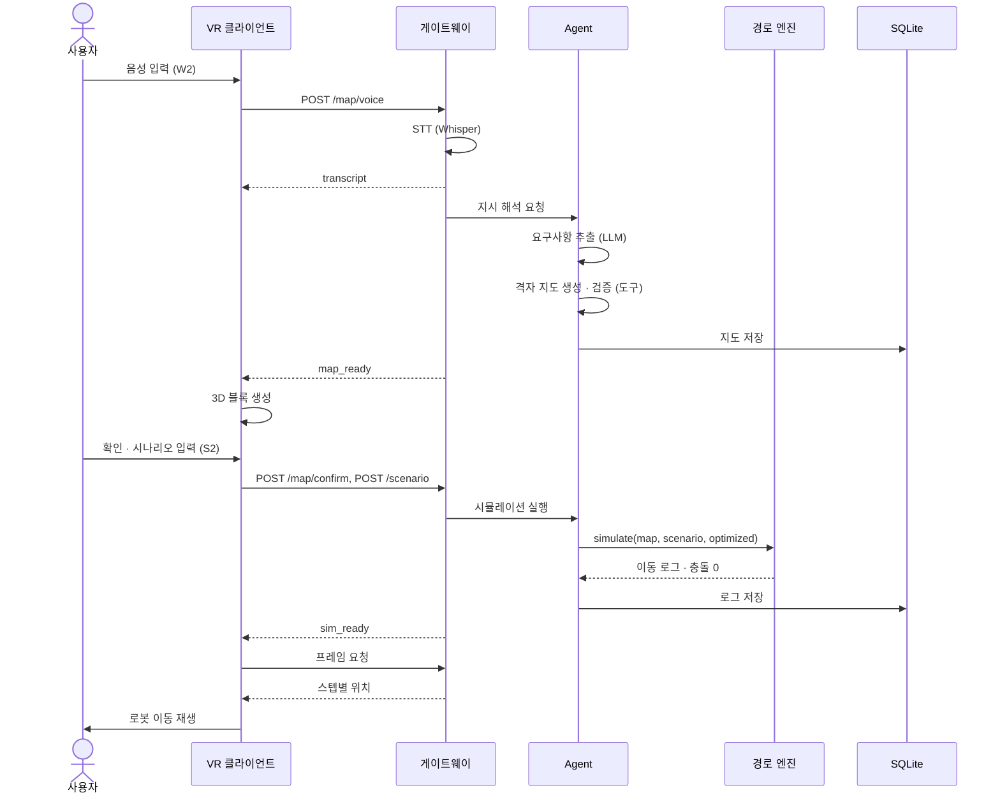

# 구현 시나리오 명세

| 항목 | 내용 |
|---|---|
| 근거 문서 | 요구사항 명세서 v0.1 (FR·NFR·DR·IR), 시스템 아키텍처 |
| 팀 | 로봇웨어하우스 (방유진 · 백향 · 하재윤) |
| 문서 버전 | v0.1 (2026-09-30 초안) |

**사용법**
- 시나리오 하나가 "사용자 행동 1건이 시스템을 통과하는 경로"입니다. 담당자는 자기 이름이 적힌 단계를 구현하고, 수용 체크로 완료를 판단합니다.
- API 경로와 메시지 이름은 설계 예시입니다. `docs/api.md`(9/29 확정 명세)와 다르면 그 문서를 따르고 이 문서를 고칩니다.
- 테스트 수치(로봇 수, 주문 수)는 팀이 정한 예시값입니다. 10/2 통합 빌드 뒤 Quest 2 성능에 맞춰 조정합니다.

---

## 1. 시나리오 목록

| ID | 시나리오 | 등급 | 관련 요구사항 | 주 담당 | 완료 목표 |
|---|---|:-:|---|---|---|
| SC-01 | 텍스트로 창고 구성 | P0 | FR-01, 03, 04, 06, 07, 09, 20 | 방유진·백향 | 10/1 |
| SC-02 | 음성으로 창고 구성 | P0 | FR-02, 03, 04 | 방유진·백향 | 10/1 |
| SC-03 | 검증 실패 → 수정 질문 → 재생성 | P0 | FR-06, 07, 08 | 방유진 | 10/1 |
| SC-04 | 시나리오 입력 → 시뮬레이션 실행 | P0 | FR-11, 12, 14, 15, 16 | 하재윤·백향 | 10/1 |
| SC-05 | VR 이동 재생·배속 | P0 | FR-21, 22 | 백향 | 10/2 |
| **E2E** | **SC-02 → SC-04 → SC-05 연속 실행** | **P0** | 시연 최소 시나리오 | 전원 | **10/2** |
| SC-06 | 경로 선·히트맵 표시 | P1 | FR-23, 24, 25 | 백향·방유진 | 10/3 |
| SC-07 | 기준 전략 비교 | P1 | FR-18, 28 | 하재윤·방유진 | 10/3 |
| SC-08 | 롤링 재계획 | P1 | FR-19 | 하재윤 | 10/3 |
| SC-09 | 병목 분석·개선안 설명 | P1 | FR-26, 27 | 방유진 | 10/4 |
| SC-10 | 개선안 승인 → 재시뮬레이션 | P2 | FR-29 | 방유진·하재윤 | 10/4 |
| SC-11 | VR에서 랙 옮기기 | P2 | FR-10 | 백향 | 10/4 |
| SC-12 | 기본값 적용 안내 | P1 | FR-05 | 방유진 | 10/3 |
| EX-01~04 | 예외 처리 | P0 | NFR-06 | 전원 | 10/2 |

---

## 2. 공통 테스트 데이터

### 2.1 창고 구성 문장

| ID | 입력 문장 | 기대 요구사항 | 기대 결과 |
|---|---|---|---|
| W1 | "랙 4줄, 통로 폭 3m, 입하 도크 1개, 출하 도크 1개로 만들어줘" | racks=4, aisle=3, dock_in=1, dock_out=1 | 검증 통과 (소형) |
| W2 | "랙 8줄, 통로 폭 3m, 입하 도크 2개, 출하 도크 1개, 충전 구역은 오른쪽 벽 쪽에" | racks=8, aisle=3, dock_in=2, dock_out=1, charge=right | 검증 통과 (신청서 예시, 시연용) |
| W3 | "랙 6줄을 좌우 두 구역으로 나누고 가운데 큰 통로는 북쪽 방향 일방통행" | racks=6, zones=2, one_way=N | 검증 통과 (구조가 다른 창고) |
| W4 | "랙 10줄을 통로 없이 붙여서 배치해줘" | racks=10, aisle=0 | 검증 실패: 도달 불가 → SC-03 |
| W5 | "랙 6줄, 통로 폭 3m" | 도크 정보 없음 | 검증 실패: 도크 누락 → SC-03 |
| W6 | "적당한 크기로 창고 하나 만들어줘" | 대부분 누락 | 기본값 적용 + 안내 → SC-12 |

> 지도 생성 성공률(NFR-05)은 W1~W3를 표현만 바꾼 문장 `[N]`개로 측정합니다. 예: "선반 4열", "통로 3미터", "들어오는 곳 1개".

### 2.2 시뮬레이션 조건

| ID | 창고 | 로봇 수 | 주문 수(입하/출하) | 용도 |
|---|:-:|:-:|:-:|---|
| S1 | W1 | 2 | 10 / 10 | 개발 중 빠른 확인 |
| S2 | W2 | 4 | 25 / 25 | 시연 기본 |
| S2-H | W2 | 8 | 25 / 25 | 혼잡 유도 (히트맵·병목 시연) |
| S3 | W3 | 4 | 25 / 25 | 다른 구조 적용 확인 (NFR-09) |
| S2-R | W2 | 4 → 6 | 25 / 25 + 신규 10 | 롤링 재계획 (SC-08) |

---

## 3. 시나리오 상세

> 주체 표기: **[VR]** Unity 클라이언트(백향) · **[GW]** FastAPI 게이트웨이 · **[AG]** LangGraph Agent(방유진) · **[EN]** 경로 계산 엔진(하재윤) · **[DB]** SQLite

### SC-01 텍스트로 창고 구성 (P0)

**목적:** 사용자가 입력한 문장으로 창고를 만들어 VR에 띄운다.
**사전 조건:** 서버 실행 중, Quest 2와 서버가 같은 Wi-Fi, VR 앱에서 서버 연결 완료

**기본 흐름**

| 단계 | 주체 | 동작 | 데이터 |
|:-:|---|---|---|
| 1 | 사용자 | VR 입력 패널에 W2 문장 입력 후 "생성" 누름 | — |
| 2 | [VR] | `POST /map/text` 전송, 패널에 "생성 중" 표시 | `{session_id, text}` |
| 3 | [AG] | 지시 해석 노드: LLM이 요구사항 JSON 추출 | `{racks, aisle_width, docks, charge}` |
| 4 | [AG] | 격자 지도 생성 도구 호출 | 격자 지도 JSON (DR-01) |
| 5 | [AG] | 지도 검증 도구 호출: 형식 검사 + 도달 가능성 검사 | `{valid: true, errors: []}` |
| 6 | [DB] | 지도 저장 (`map_version` 부여) | — |
| 7 | [GW] | WebSocket으로 `map_ready` 전송 | `{map_version, map, summary}` |
| 8 | [VR] | 격자 지도를 3D 블록으로 생성, 패널에 요약 + "확인" 버튼 표시 | — |
| 9 | 사용자 | 배치를 둘러본 뒤 "확인" 누름 | — |
| 10 | [VR] | `POST /map/confirm` 전송 → 지도 상태가 `confirmed`로 바뀜 | `{map_version}` |

**대안 흐름**
- 5단계 검증 실패 → SC-03으로 이동
- 3단계 필수 값 누락 → 기본값을 채우고 SC-12 안내 추가

**사후 조건:** 확정된 지도(`confirmed`) 1개가 DB에 있고, VR에 같은 배치가 보인다.

**수용 체크**
- [ ] W1, W2, W3 모두 VR에 생성된다
- [ ] 서버 JSON의 랙 칸 좌표와 VR 블록 좌표가 모두 일치한다 (FR-20)
- [ ] "확인" 전에는 시뮬레이션 버튼이 비활성 상태다 (FR-09)

**구현 포인트**
- 방유진: LLM이 요구사항만 뽑게 하고, 격자 좌표 계산은 도구 코드가 맡는다. LLM에게 좌표를 직접 만들게 하면 오류가 늘어난다.
- 백향: 블록은 칸 유형별 프리팹 1개씩 두고 인스턴싱으로 생성한다. 격자 (x, y)는 Unity (x, 0, y)로 대응시키고 원점 기준을 `docs/schema.md`에 적는다.

---

### SC-02 음성으로 창고 구성 (P0)

**목적:** 말로 창고를 만든다. 시연 첫 장면이다.
**사전 조건:** SC-01과 같음, Quest 2 마이크 권한 허용

**기본 흐름**

| 단계 | 주체 | 동작 | 데이터 |
|:-:|---|---|---|
| 1 | 사용자 | 녹음 버튼을 누른 채 W2 문장을 말함 | — |
| 2 | [VR] | 버튼을 놓으면 녹음 종료, WAV로 인코딩 후 `POST /map/voice` 전송 | `{session_id, audio}` |
| 3 | [GW] | Whisper STT 호출 | `{text}` |
| 4 | [GW] | 인식 결과를 WebSocket `transcript`로 전송 | `{text}` |
| 5 | [VR] | 패널에 인식된 문장 표시 | — |
| 6 | — | 이후 SC-01의 3~10단계와 같음 | — |

**예외:** STT 결과가 비었거나 인식에 실패하면 → EX-03

**수용 체크**
- [ ] W1, W2를 말했을 때 패널에 인식 문장이 표시되고 지도가 생성된다
- [ ] 녹음 종료부터 인식 문장 표시까지 걸린 시간을 기록한다 (목표값은 10/2 실측 뒤 정함)

**구현 포인트**
- 백향: Unity `Microphone` API로 녹음 → WAV 바이트 변환 → multipart 전송. 녹음 길이 상한(예: 15초)을 둔다.
- 방유진: 서버에 STT 결과 텍스트를 로그로 남겨 성공률 측정에 쓴다.

---

### SC-03 검증 실패 → 수정 질문 → 재생성 (P0)

**목적:** LLM이 만든 지도를 그대로 믿지 않고, 검증과 질문으로 바로잡는 Agent 동작을 보여 준다.
**입력:** W4(도달 불가) 또는 W5(도크 누락)

**기본 흐름**

| 단계 | 주체 | 동작 | 데이터 |
|:-:|---|---|---|
| 1 | [AG] | SC-01 5단계에서 검증 실패 | `{valid: false, errors: [{code: "UNREACHABLE", cells: [[4,2],…]}]}` |
| 2 | [AG] | 오류 코드를 보고 LLM이 사용자용 질문을 만든다 | "랙 사이에 통로가 없어 로봇이 닿지 못합니다. 통로 폭을 몇 m로 할까요?" |
| 3 | [GW] | WebSocket `question` 전송 | `{question_id, text, error_cells}` |
| 4 | [VR] | 패널에 질문 표시, 문제 칸을 빨간색으로 강조 | — |
| 5 | 사용자 | 텍스트나 음성으로 답변 ("통로 3m로 해줘") | — |
| 6 | [VR] | `POST /map/answer` 전송 | `{question_id, text}` |
| 7 | [AG] | 기존 요구사항에 답변을 합쳐 다시 지시 해석 → 생성 → 검증 | — |
| 8 | — | 통과하면 SC-01 6단계로 이동 | — |

**반복 제한:** 같은 세션에서 수정 질문은 최대 3회까지 한다. 넘으면 "입력을 다시 해 주세요" 안내 후 처음으로 돌아간다.

**오류 코드 (검증 도구 출력)**

| 코드 | 의미 | 질문 예시 |
|---|---|---|
| `SCHEMA_INVALID` | 필수 필드 누락, 값 오류 | (사용자에게 묻지 않고 Agent가 재생성) |
| `UNREACHABLE` | 통로로 닿지 않는 랙·도크 존재 | "통로 폭을 몇 m로 할까요?" |
| `NO_DOCK_IN` / `NO_DOCK_OUT` | 입하·출하 도크 없음 | "입하 도크는 몇 개, 어느 벽에 둘까요?" |
| `SIZE_EXCEEDED` | 격자가 상한 초과 | "창고 크기를 줄일까요?" |

**수용 체크**
- [ ] W4, W5 입력 시 질문이 나오고, 답변 후 검증을 통과한다
- [ ] 문제 칸이 VR에 강조된다
- [ ] 3회 초과 시 안내 문구로 끝난다

---

### SC-04 시나리오 입력 → 시뮬레이션 실행 (P0)

**목적:** 확정된 지도에서 주문과 로봇 수를 넣고 다중 로봇 경로를 계산한다.
**사전 조건:** `confirmed` 지도 존재

**기본 흐름**

| 단계 | 주체 | 동작 | 데이터 |
|:-:|---|---|---|
| 1 | 사용자 | 패널에서 로봇 수 4, 입하 25, 출하 25 입력 후 "실행" | — |
| 2 | [VR] | `POST /scenario` 전송 | `{map_version, robots: 4, inbound: 25, outbound: 25}` |
| 3 | [EN] | 주문 생성기: 규격·도착 스텝을 붙인 주문 50건 생성 | `orders[]` (DR-02) |
| 4 | [AG] | 시뮬레이션 실행 노드 → 엔진 호출 (`strategy: optimized`) | — |
| 5 | [EN] | 보관 위치 선정 → 작업 할당(가장 가까운 유휴 로봇) → 다중 로봇 경로 계산 | — |
| 6 | [EN] | 충돌 검사 (같은 칸·같은 스텝, 맞교환) | `{collisions: 0}` |
| 7 | [DB] | 스텝별 위치, 주문 처리 기록, 칸별 통과·대기 저장 | DR-03 |
| 8 | [GW] | WebSocket `sim_ready` 전송 | `{sim_id, total_steps, robots, summary}` |

**예외:** 충돌이 1건 이상이면 결과를 VR로 보내지 않고 서버 로그에 기록 → 하재윤 디버깅 대상

**수용 체크**
- [ ] S1, S2, S3에서 모든 주문이 완료된다
- [ ] 충돌 검사 0건 (NFR-04)
- [ ] 주문 1건이 로봇 1대에게만 할당된다 (FR-14)
- [ ] 보관 칸이 규격·용량을 넘지 않는다 (FR-15)

**구현 포인트**
- 하재윤: 먼저 우선순위 계획(시공간 A*, 예약 테이블)으로 충돌 0건을 확보하고, CBS는 비교용으로 붙인다. 엔진 입출력은 순수 함수(`simulate(map, scenario, strategy) -> log`)로 만들어 Agent·실험 스크립트가 같이 쓴다.
- 방유진: Agent 노드는 엔진을 직접 구현하지 않고 도구로 감싸 호출만 한다.

---

### SC-05 VR 이동 재생·배속 (P0)

**목적:** 계산된 경로를 VR에서 로봇 이동으로 보여 준다.
**사전 조건:** `sim_ready` 수신

**기본 흐름**

| 단계 | 주체 | 동작 | 데이터 |
|:-:|---|---|---|
| 1 | [VR] | 로봇 수만큼 큐브 생성, 시작 위치에 배치 | — |
| 2 | [VR] | 프레임 요청 (`GET /sim/{id}/frames?from=0&to=200`) 또는 WebSocket 스트림 구독 | `{t, robots: [{id, x, y, state}]}` |
| 3 | [VR] | 스텝 사이를 선형 보간해 이동 재생, 상태별 색상(이동·적재·대기) 표시 | — |
| 4 | 사용자 | 재생·일시정지, 배속 1x / 2x / 4x 선택 | — |
| 5 | [VR] | 재생 끝에 요약 표시 (총 스텝, 완료 주문 수) | — |

**수용 체크**
- [ ] 샘플링한 스텝 10개에서 로그 위치와 VR 위치가 같다 (FR-21)
- [ ] 배속 변경이 바로 반영된다 (FR-22)
- [ ] S2(로봇 4대), S2-H(8대)에서 Quest 2 FPS를 기록한다 (NFR-01)

**구현 포인트**
- 백향: 프레임은 일정 구간씩 미리 받아 버퍼에 두고 재생한다. 네트워크 지연이 재생 끊김으로 이어지지 않게 하려는 것이다.
- 로봇 큐브는 같은 머티리얼을 쓰고 색은 MaterialPropertyBlock으로 바꿔 드로우콜을 줄인다.

---

### E2E 시연 최소 시나리오 (P0, 10/2 마일스톤)

**흐름:** SC-02(W2 음성) → SC-01 7~10단계(VR 생성·확인) → SC-04(S2) → SC-05(재생)

**합격 기준:** 위 흐름을 사람 손 개입(서버 재시작, 수동 파일 복사) 없이 3회 연속 성공한다. 성공하면 바로 백업 영상을 녹화한다.

---

### SC-06 경로 선·히트맵 표시 (P1)

| 단계 | 주체 | 동작 | 데이터 |
|:-:|---|---|---|
| 1 | [EN]→[DB] | 시뮬레이션 중 칸별 통과·대기 횟수 집계 (SC-04 7단계에서 저장됨) | `{x, y, pass, wait}` |
| 2 | [VR] | `GET /sim/{id}/stats` 요청 | — |
| 3 | [VR] | 대기 횟수를 0~1로 정규화해 바닥 텍스처 색상으로 칠함 | — |
| 4 | 사용자 | "히트맵" 토글, "경로 선" 토글 + 로봇 선택 | — |
| 5 | [VR] | 선택한 로봇의 전체 경로를 LineRenderer로 표시 | — |

**수용 체크**
- [ ] S2-H에서 대기가 몰린 칸이 진한 색으로 보인다 (FR-24)
- [ ] 로봇별 경로 선을 켜고 끌 수 있다 (FR-23)
- [ ] 히트맵 상위 5칸이 DB 집계 상위 5칸과 같다 (FR-25)

**구현 포인트:** 히트맵은 칸마다 오브젝트를 만들지 않고 격자 크기의 Texture2D 한 장에 픽셀로 칠해 바닥에 입힌다.

---

### SC-07 기준 전략 비교 (P1)

| 단계 | 주체 | 동작 |
|:-:|---|---|
| 1 | [AG] | 같은 지도·시나리오로 `baseline`, `optimized` 두 번 실행 |
| 2 | [EN] | baseline: 무작위 보관 + 선착순 할당 + 로봇별 개별 최단 경로(충돌은 대기로 처리) |
| 3 | [AG] | 비교 리포트 도구: 총 처리 스텝, 주문당 평균, 대기 합계, 개선율 계산 |
| 4 | [VR] | 결과 패널에 두 값과 개선율 표시, 재생 전략 전환 버튼 |

**수용 체크**
- [ ] S1, S2, S3, S2-H 각각 비교 결과가 나온다
- [ ] 개선율 = (기준 − 최적화) ÷ 기준 × 100 이 리포트 값과 같다
- [ ] 무작위 요소는 시드를 고정해 같은 입력이면 같은 결과가 나온다

---

### SC-08 롤링 재계획 (P1)

**입력:** S2-R (재생 중 스텝 100에 신규 주문 10건 추가, 로봇 4 → 6대)

| 단계 | 주체 | 동작 |
|:-:|---|---|
| 1 | 사용자 | 재생 중 패널에서 "주문 추가" 또는 "로봇 수 변경" |
| 2 | [VR] | `POST /sim/{id}/event` 전송 (`{t: 100, add_orders: 10, robots: 6}`) |
| 3 | [EN] | 스텝 100까지의 결과는 유지하고, 이후 구간만 다시 할당·계산 |
| 4 | [EN] | 재계획 소요 시간 기록 (NFR-03) |
| 5 | [VR] | 스텝 100 이후 프레임을 새 결과로 교체해 계속 재생 |

**수용 체크**
- [ ] 변경 이후 충돌 0건
- [ ] 추가 주문이 모두 완료된다
- [ ] 재계획 시간이 로그에 남는다

---

### SC-09 병목 분석·개선안 설명 (P1)

| 단계 | 주체 | 동작 | 데이터 |
|:-:|---|---|---|
| 1 | 사용자 | "분석" 버튼 또는 "어디가 막혀?"라고 말함 | — |
| 2 | [AG] | 로그 집계 도구: 대기 상위 칸, 구역별 대기 합, 로봇별 유휴 시간 | 병목 후보 목록 |
| 3 | [AG] | LLM이 집계 수치만 근거로 원인과 개선 방향 작성 | 설명 텍스트 + 개선안 1~3개 |
| 4 | [GW] | WebSocket `analysis` 전송 | `{bottlenecks: [{x, y, wait}], explanation, proposals}` |
| 5 | [VR] | 병목 칸에 마커 표시, 패널에 설명과 개선안 버튼 표시 | — |

**개선안 유형 (엔진이 적용할 수 있는 것만 제안하도록 제한)**

| 유형 | 예시 | 적용 방법 |
|---|---|---|
| 일방통행 지정 | "3번 통로를 북쪽 일방통행으로" | `rules.one_way` 추가 |
| 보관 위치 변경 | "출하가 잦은 제품을 출하 도크 가까운 랙에" | 보관 위치 선정 가중치 변경 |
| 로봇 수 조정 | "로봇 8대 → 6대" | 시나리오 값 변경 |
| 도크 추가 | "입하 도크 1개 추가" | 지도 수정 후 재검증 |

**수용 체크**
- [ ] 설명에 병목 좌표나 수치가 1개 이상 들어간다 (FR-27)
- [ ] 개선안이 위 4개 유형 안에서만 나온다
- [ ] S2-H에서 병목 마커 위치가 히트맵 진한 칸과 같다 (FR-26)

**구현 포인트:** LLM에게 원본 로그를 넘기지 말고 집계 결과(상위 10칸, 구역별 합계)만 넘긴다. 토큰을 줄이고 수치를 지어내는 일을 막을 수 있다.

---

### SC-10 개선안 승인 → 재시뮬레이션 (P2)

| 단계 | 주체 | 동작 |
|:-:|---|---|
| 1 | 사용자 | 개선안 버튼 중 하나 선택 → "적용" |
| 2 | [VR] | `POST /improve/approve` (`{proposal_id}`) |
| 3 | [AG] | 개선안을 지도·시나리오에 적용 → 지도가 바뀌면 검증 다시 실행 |
| 4 | [EN] | 같은 주문으로 재시뮬레이션 |
| 5 | [VR] | 적용 전·후 처리 스텝과 대기 합계를 나란히 표시, 히트맵 전환 버튼 |

**수용 체크**
- [ ] 승인하지 않으면 지도·시나리오가 바뀌지 않는다
- [ ] 적용 전·후 비교가 표시된다

---

### SC-11 VR에서 랙 옮기기 (P2)

| 단계 | 주체 | 동작 |
|:-:|---|---|
| 1 | 사용자 | 컨트롤러로 랙 블록을 잡아 다른 칸으로 옮김 |
| 2 | [VR] | 격자 칸에 스냅, 벽·도크 칸 위에는 놓을 수 없게 막음 |
| 3 | [VR] | `POST /map/edit` (`{map_version, moves: [{rack_id, from, to}]}`) |
| 4 | [AG] | 검증 도구 실행 → 통과하면 새 `map_version` 저장 / 실패하면 SC-03 질문 |

**수용 체크**
- [ ] 옮긴 뒤 서버 지도와 VR 배치가 일치한다
- [ ] 도달 불가가 되는 위치로 옮기면 경고가 나온다

---

### SC-12 기본값 적용 안내 (P1)

**입력:** W6 ("적당한 크기로 창고 하나 만들어줘")

| 단계 | 주체 | 동작 |
|:-:|---|---|
| 1 | [AG] | 누락 항목 확인 → 기본값 표로 채움 |
| 2 | [VR] | 패널에 "기본값 적용: 랙 6줄, 통로 폭 3m, 입하 1, 출하 1" 표시 |
| 3 | 사용자 | 그대로 "확인"하거나 값을 말해서 수정 |

**기본값 (팀 결정 필요)**

| 항목 | 기본값 | 근거 |
|---|---|---|
| 랙 줄 수 | `[6]` | 팀 결정 |
| 통로 폭 | `[3m]` | 신청서 예시 |
| 입하·출하 도크 | `[1 / 1]` | 팀 결정 |
| 랙 단 수 | `[3]` | 팀 결정 |
| 칸 수용 규격 | `[파레트 규격]` | 공개 규격 수치 (출처 별지2) |

---

## 4. 예외 시나리오

| ID | 상황 | 감지 | 시스템 동작 | 사용자에게 보이는 것 |
|---|---|---|---|---|
| EX-01 | LLM이 스키마에 맞지 않는 JSON 반환 | 스키마 검증 실패 | 같은 프롬프트로 최대 2회 재시도 → 실패 시 수정 질문으로 전환 | "다시 이해해 볼게요" → 질문 |
| EX-02 | 서버 연결 끊김 | WebSocket 종료 이벤트 | VR이 5초 간격으로 재연결, 마지막 `map_version`·`sim_id`로 상태 복구 | "서버 재연결 중" 표시 |
| EX-03 | STT 인식 실패·빈 결과 | 텍스트 길이 0 | 요청 중단 | "잘 못 들었어요. 다시 말하거나 입력해 주세요" |
| EX-04 | 외부 API 시간 초과 | 응답 대기 상한 초과 | 요청 취소, 로그 기록 | "응답이 늦어요. 다시 시도해 주세요" + 재시도 버튼 |

**시연 대비:** 네트워크 문제에 대비해 W2 + S2 결과(지도 JSON, 프레임 로그)를 VR 앱 안에 미리 넣어 두고, "오프라인 재생" 버튼으로 재생할 수 있게 한다. 이 버튼은 발표 때 실패했을 때만 쓰고, 영상에는 실제 흐름을 녹화한다.

---

## 5. 메시지 형식 예시

> `docs/api.md`가 우선입니다. 필드 이름이 다르면 이 절을 고칩니다.

**REST (VR → 서버)**

| 메서드·경로 | 요청 | 응답 | 시나리오 |
|---|---|---|---|
| `POST /map/text` | `{session_id, text}` | `{request_id}` | SC-01 |
| `POST /map/voice` | multipart `{session_id, audio}` | `{request_id}` | SC-02 |
| `POST /map/answer` | `{question_id, text}` | `{request_id}` | SC-03 |
| `POST /map/confirm` | `{map_version}` | `{status}` | SC-01 |
| `POST /map/edit` | `{map_version, moves[]}` | `{request_id}` | SC-11 |
| `POST /scenario` | `{map_version, robots, inbound, outbound}` | `{sim_id}` | SC-04 |
| `GET /sim/{id}/frames` | `from, to` | `[{t, robots[]}]` | SC-05 |
| `GET /sim/{id}/stats` | — | `[{x, y, pass, wait}]` | SC-06 |
| `POST /sim/{id}/event` | `{t, add_orders, robots}` | `{status}` | SC-08 |
| `POST /analyze` | `{sim_id}` | `{request_id}` | SC-09 |
| `POST /improve/approve` | `{proposal_id}` | `{sim_id}` | SC-10 |

**WebSocket (서버 → VR)**

| type | 내용 | 시나리오 |
|---|---|---|
| `transcript` | `{text}` | SC-02 |
| `map_ready` | `{map_version, map, summary, defaults_applied[]}` | SC-01, SC-12 |
| `question` | `{question_id, text, error_cells[]}` | SC-03 |
| `sim_ready` | `{sim_id, strategy, total_steps, summary}` | SC-04 |
| `compare` | `{baseline, optimized, improvement_pct}` | SC-07 |
| `analysis` | `{bottlenecks[], explanation, proposals[]}` | SC-09 |
| `error` | `{code, message}` | EX-01~04 |

---

## 6. 통합 테스트 순서

| 날짜 | 통과해야 할 시나리오 | 확인 방법 |
|---|---|---|
| 10/1(목) 저녁 | SC-01(W1), SC-03(W4), SC-04(S1) | 서버 단독 테스트 + VR에 지도 표시 |
| 10/2(금) 저녁 | SC-02, SC-05, **E2E 3회 연속** | Quest 2 실기기, 백업 영상 녹화 |
| 10/3(토) 저녁 | SC-06, SC-07, SC-08, SC-12 | S2-H 히트맵, 비교 리포트 |
| 10/4(일) 저녁 | SC-09, SC-10, SC-11, EX-01~04 | 전체 회귀: SC-01~05 다시 실행 후 기능 동결 |
| 10/5(월) | 시연 시나리오 리허설 | 3분 영상 촬영, 실험 결과표 작성 |

**회귀 규칙:** 새 기능을 병합할 때마다 E2E(W2 + S2)를 한 번 돌려 깨지지 않았는지 확인한다.

---

## 7. 시연 시나리오 (영상·발표용)

| 순서 | 시나리오 | 입력 | 보여 줄 것 |
|:-:|---|---|---|
| 1 | SC-02 | W2 음성 | 인식 문장, 3D 창고 생성 |
| 2 | SC-03 | "도크는 빼줘" 같은 실패 유도 발화 | 질문 → 답변 → 재생성 (Agent 판단 과정) |
| 3 | SC-04·05 | S2-H (로봇 8대) | 다중 로봇 이동, 배속 |
| 4 | SC-06 | 히트맵 토글 | 혼잡 구간 색상 |
| 5 | SC-09 | "어디가 막혀?" | 병목 마커와 수치 기반 설명 |
| 6 | SC-10 / SC-07 | 개선안 승인 | 적용 전·후 처리 시간 비교 |

> P1·P2가 구현되지 않으면 해당 순서를 빼고 1 → 3 → 결과 요약으로 줄입니다.
